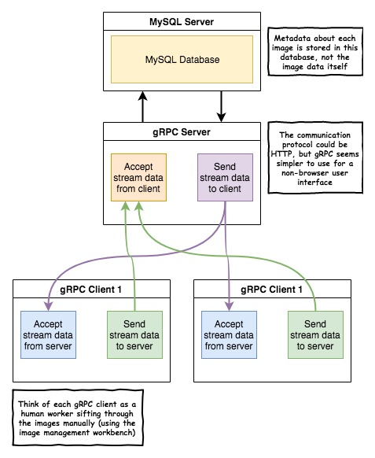

# Image Management System

> The purpose of this project is to give non-technical users a way to manage directories containing large numbers of image files in a scalable way. The end use-case is for a company to distribute this program on several work stations (each with a copy of the image directory), hire a few part-time workers to sift through all the images using this system, and to label them by hand.

### Visual description of the overall architecture



### Installing some dependencies

```bash
# Some dependencies
$ go get golang.org/x/exp/shiny/driver &
$ go get golang.org/x/exp/shiny/screen &
$ go get golang.org/x/mobile/event/lifecycle &
$ go get golang.org/x/mobile/event/key &
$ go get -u github.com/disintegration/imaging &
```

### Documentation

```bash
https://godoc.org/github.com/disintegration/imaging
```

### Running the unit tests

```bash
$ go test
# Expect the output to looks something like this...
PASS
ok      github.com/KwakSeungeun/Image-Management        0.045s
```

### Next Task

```bash
$ UpArrow key : up brightness
$ DownArrow key : down brightness
$ 'z' key : up contrast
$ 'x' key : down contrast
$ 'a' key : crop right side
$ 'd' key : crop left side
$ 'w' key : crop bottom side
$ 's' key : crop top side
```